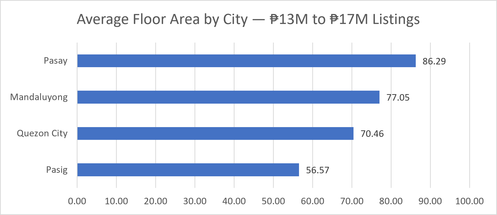
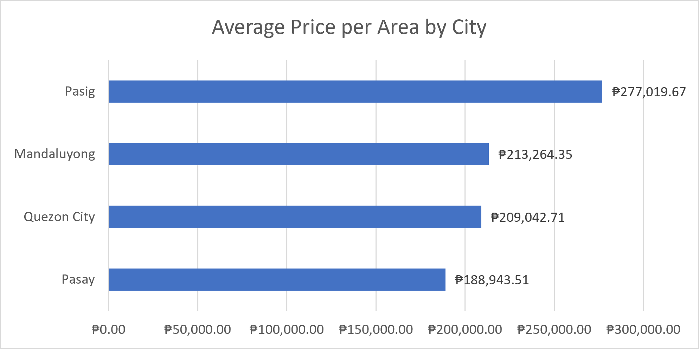

# Metro Manila Real Estate: What Do You Actually Get for ₱13–17M?

**Business question:** If a buyer has around ₱15 million to spend on a property in Metro Manila, which city gives the best value — and what would they actually get for that budget in terms of floor area, bedrooms, and price per square meter?

---

## Data
- **Source:** [Philippine Real Estate dataset](https://www.kaggle.com/datasets/arloblanco/philippine-real-estate) — scraped from lamudi.com.ph (public domain, CC0)
- **Scope:** Filtered from the full national dataset down to Metro Manila listings only. 12 of 17 Metro Manila cities were present in the raw data — Caloocan, Malabon, Marikina, Navotas, and Pateros had no listings, likely reflecting lower listing activity on this platform
- **Final working set:** 1,042 Metro Manila listings, further filtered to a ₱13M–₱17M price band → **222 listings across 4 cities**

---

## Tools
- **Excel** — Text to Columns (parsing combined location field), Number Filters, Pivot Tables, AVERAGEIF/AVERAGEIFS, calculated columns (Price per sqm)

---

## Process
1. Identified that the raw `Location` field combined barangay and city into one text string (e.g. "Ugong, Pasig") — split into separate columns using Text to Columns before any city-level filtering was possible
2. Built a pivot table of unique city values to confirm which Metro Manila cities were present in the data
3. Filtered to Metro Manila cities, then further filtered to the ₱13M–₱17M price band
4. Added a calculated column: `Price_per_sqm = Price (PHP) ÷ Floor_area (sqm)` to normalize comparisons across cities
5. Built a summary pivot table: average floor area, bedrooms, bathrooms, price, and price per sqm by city
6. **Added listing count per city before drawing any conclusions** to catch small-sample issues — this surfaced two cities (San Juan and Taguig) with insufficient data, which were removed from the final analysis

---

## Findings

| City | Avg Floor Area (sqm) | Avg Bedrooms | Avg Bath | Avg Price | Avg Price/sqm | n |
|---|---|---|---|---|---|---|
| Mandaluyong | 77 | 2 | 2 | ₱16,198,175 | ₱213,264 | 19 |
| Pasay | 86 | 2 | 2 | ₱15,316,571 | ₱188,944 | 7 |
| Pasig | 57 | 1 | 1 | ₱15,670,175 | ₱277,020 | 183 |
| Quezon City | 70 | 2 | 2 | ₱14,457,098 | ₱209,043 | 13 |

**Key findings:**

- **Pasay offers the most space and lowest price per sqm** (₱188,944/sqm, 86 sqm avg) — the clearest value proposition in this price band, though with only 7 listings, this should be treated as directional
- **Pasig is the most data-reliable city** (n=183) and shows a consistent mid-range profile: moderate space (57 sqm) at a higher price per sqm (₱277,020) — suggesting buyers pay a location premium in Pasig
- **Quezon City offers a balanced option** — decent floor area (70 sqm), lowest average price (₱14.5M), and a reasonable price per sqm (₱209,043), though sample size (n=13) limits confidence
- **Mandaluyong commands the highest average price (₱16.2M)** with mid-range space — likely reflecting condo unit premiums in a central location

---

## Limitations
- Comparisons are based on listing (asking) prices, not actual transaction prices — sale prices may differ
- Several cities have small samples (Pasay n=7, Quezon City n=13) — averages are directional, not statistically confirmed
- Location tagging inconsistencies were identified and corrected during cleaning: listings labeled under Metro Manila city names were found to belong to other provinces (e.g. San Juan, Batangas appearing as San Juan) and were removed from the analysis
- Dataset reflects one listing platform (lamudi.com.ph) at a single point in time and does not represent the full market
- Listings with missing floor area values were excluded from price per sqm calculations

---

## Next Steps
- Pull a larger sample or wider price band to validate the Pasay and Quezon City signals with more data
- Analyze price trends over time if date data becomes available
- Break down findings further by property type (condo vs. house vs. townhouse) within each city
